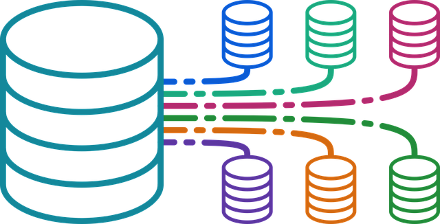

# David Garcia's ePortfolio

## Professional Self Assessment
My journey at Southern New Hampshire University provided me with extensive knowledge of software engineering and many other concepts within the field of computer science. Throughout the bachelor’s computer science program, I learned how to program in three different languages which include Python, C++, and Java. I dabbled in HTML during a full stack development course. I created and managed SQL, NoSQL, and MongoDB databases. During CS 250 I dove into the ever-changing concepts of a software development life cycle and studied the agile SDLC workspace. I created test cases and learned how to program with quality in mind in CS 320. In CS 319 I studied the concept of UI/UX design so that the end user can use the application quickly and easily while looking at something that is pleasing. This program sparked many interests for me within the computer science field and I am eager to dive headfirst into my career.

During my courses I learned how to collaborate/communicate with others through my computer screen effectively. Composing emails with pertinent information when needing help or helping others. Peer discussion boards were filled with differing points of views and experiences. Properly commenting code so that anyone can hop in and work on the team project. Most of the CS courses included a scenario where we had to communicate with shareholders and present data/information in layman terms so that everyone could understand what was being presented. Alongside learning how to communicate in a professional setting, I was taught the basics of programming data structures and algorithms. My knowledge of working with data structures and algorithms can be seen when looking at artifact two. During CS 300 Data Structures and Algorithms I learned about several complex data structures and algorithmic design which has aided me during any problem-solving scenario. When first learning about C++ and Java I was also taught about the importance of software designing. More specifically, designing code that is object-oriented, portable, and easy to read. Writing pseudocode and planning before starting a coding project can save a lot of time in the future. Lastly, security played a big part in the middle and end of my educational journey. In CS 305 Software Security I studied advanced security concepts and implemented those concepts by completing coding projects/labs. I worked with checksums, keystores, generated security certificates, and implemented user input validation.

Below are three enhanced artifacts that I chose to include for this portfolio. Each artifact showcases my knowledge and abilities in the categories of software design and engineering, data structures and algorithms, and databases. Artifact One displays my ability to design and engineer not only software but also a simple UI that is cohesive. Artifact Two shows my problem-solving skills using data structures (a vector) and algorithms (an insertion algorithm) to add a whole new functionality that was not present before. Artifact Three presents a small full stack website that has a functioning database that holds information such as trip details and user login info. All three artifacts contain a degree of security from simple user input validation to a secure login/register function.

## Code Review
<a href="https://drive.google.com/file/d/1QbpwW9HIpHETJ2bnbCWc6YFDMLsQKisG/view?usp=drive_link" title="Go to Artifact One Narrative">Click Here to Watch Code Review</a>  
This code review covers the relevant code in relation to the three artifacts.

## Artifact One: Software Design and Engineering
<a href="https://github.com/DavidG212/Davids_ePortfolio/blob/main/Artifact%20One/CS%20499%20Artifact%20One%20Narrative.pdf" title="Go to Artifact One Narrative">Go to Artifact One Narrative</a>  
This first artifact is a Java inventory management mobile application that contains a fully functioning login system and a revamped user interface that stands out from the original. The artifact narrative reflects on why I chose this application to showcase my abilities within software design and engineering.

## Artifact Two: Algorithms and Data Structure

<a href="https://github.com/DavidG212/Davids-ePortfolio/blob/main/Artifact%20Two/CS%20499%20Artifact%20Two%20Narrative.pdf" title="Go to Artifact Two Narrative">Go to Artifact Two Narrative</a>  
This second artifact is a C++ program that allows a university advisor to show a list of current courses and search up specific courses. The enhancements I made to this program now allows adivsors to insert their own custom course to the list. This was accomplished by implementing an insertion algorithm that writes the courses to a txt file and then the txt file contents are loaded into a vector and displayed when instructed. The artifact narrative elaborates on why this artifact was chosen and how it applies to my knowledge of algorithms and data structures.

## Artifact Three: Databases

<a href="https://github.com/DavidG212/Davids-ePortfolio/blob/main/Artifact%20Three/CS%20499%20Artifact%20Three%20Narrative.pdf" title="Go to Artifact Three Narrative">Go to Artifact Three Narrative</a>  
This third artifact is a full stack website called Travlr which lists traveling trips. The admin is able to add and edit trips that is saved within a database. There is a login function that validates user input, registers users, saves that information, and of course logs the user in when apporpriate. The artifact narrative talks about the reason for choosing this project and examples of some of the functions. These will show my experience when working on a full stack project.

    <a href="#">
        <button style="font-size: 10px; font-weight: 500; background: #BF40BF; color: #ffffff; border-radius: 50px; border-style: solid; border-color: #00000; padding: 5px 5px;">Back to Top &#8593;</button>
    </a>

